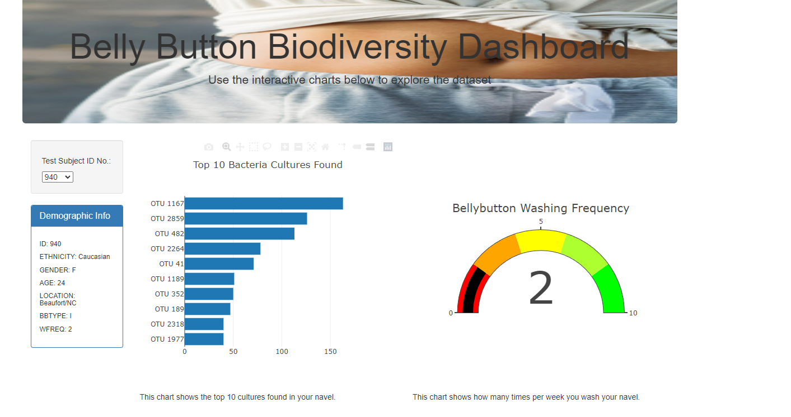

# plotly_deployment
This repository was created as part of a 6 month Data Analystics Bootcamp administed by George Washington University. This is the repository for the Module 11 Challenge. This challenge covered intermediate JavaScript topics. The webpage is written using JavaScript and HTML, and Plotly is used to create interactive charts to view the data.  

To view, please clone the repo. You will need to run a local webserver to view the content. This StackOverflow thread contains a few ways to do so:
https://stackoverflow.com/questions/10752055/cross-origin-requests-are-only-supported-for-http-error-when-loading-a-local

Once you have the local server running, you can point your browser to where it is locally hosted and view the page. 

## Summary
The purpose of this project is to create an interacitve dashboard to showcase the results of samples collected from participant's navels. The dashboard shows the participant's information, a bar graph of the top 10 bacteria cultures found, a gauge showing how often they wash their navel, and a bubble chart showing all cultures found in their navel. There is a dropdown that allows participants to find their information based on their test subject ID number, which preserves privacy. If the sponsor of the study identifies a specific bacteria culture they are interested in, participants can check if it was present in their navels.

